# Parcel Pilot

**An arcade sky-courier game where everything is made by code.** Every 3D model is a
Python script run in Blender, every sound and the music are synthesized in Python, and
every build is verified by a bot that plays the game and photographs it from the
player's camera. No downloaded, purchased, or AI-generated assets.

**[Play it in your browser](https://parcel-pilot-1ms.pages.dev/play/)** (free, no install,
keyboard or gamepad) and see the **[landing page](https://parcel-pilot-1ms.pages.dev/)** for
gameplay clips, one whole shift with sound, and all ten islands.

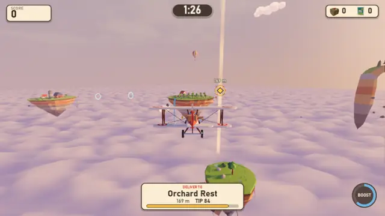

Fly a chunky red air-mail biplane across an archipelago of floating islands at golden
hour. Every delivery hands you the next parcel, the tip drains while you fly, and fast
drops add time to the shift clock and build a combo. A shift lasts two to five minutes.

| | |
|---|---|
| 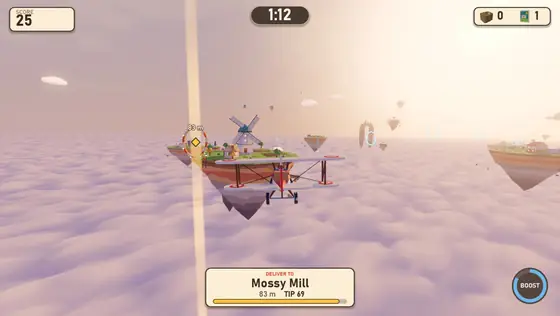<br>**Thread the hoop.** Express, on time or late. | 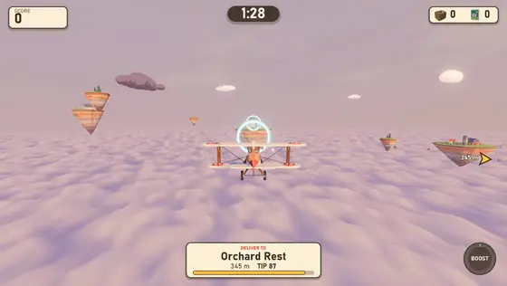<br>**Ride the rings.** They top your boost back up. |
| 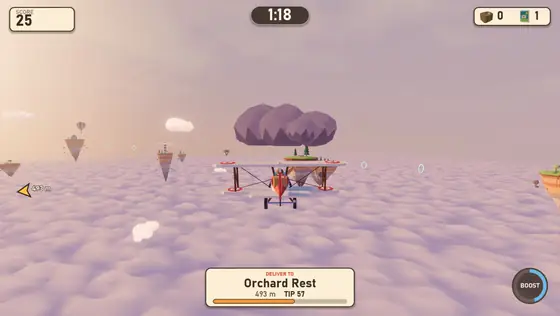<br>**Mind the weather.** Thunderclouds dent the parcel. | 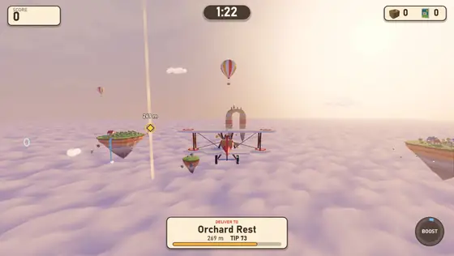<br>**Pocket the stamps.** Points and seconds. |
| 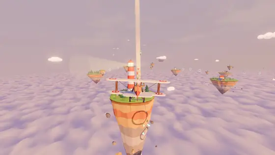<br>**Ten islands**, each one a Python script. | 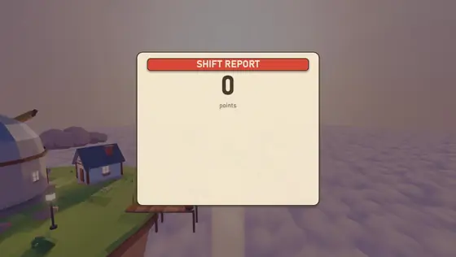<br>**Earn your rank**, from Trainee to Sky Postmaster. |

Every clip is real footage of the finished game, rendered frame by frame by Godot's movie
maker (`tools/film.py`) and cut by the event marks the game printed (`tools/make_media.py`).

## Play it

**In a browser:** [parcel-pilot-1ms.pages.dev/play](https://parcel-pilot-1ms.pages.dev/play/).
A desktop browser works best. The first visit takes up to half a minute to start while the
browser compiles the 3D shaders; after that it starts in seconds.

**On the desktop:**

1. Install [Godot 4.7](https://godotengine.org/download) (the standard build).
2. Open `game/project.godot` in Godot and press **F5**, or from a terminal:

```bash
godot --path game
```

A Windows build (`ParcelPilot.exe`, one file) comes from the `Windows Desktop` export
preset; see `HANDOFF.md` for the recipe.

| Action | Keyboard | Gamepad |
|---|---|---|
| Climb / dive | W / S or Up / Down | Left stick |
| Turn (the plane banks for you) | A / D or Left / Right | Left stick |
| Boost | Shift or Space | A or right trigger |
| Pause, settings | Esc or P | Start |

**How a shift works.** Thread the glowing hoop beside the destination island. The tip
starts at full value and drains toward a quarter as time passes; crashing dents the
parcel. Deliver fast (Express or On time) with no crashes and the combo climbs to x2.
Every delivery adds time to the clock: 15 s for Express, 10 s on time, 5 s late.
Collect floating stamps for points and seconds, fly through blue rings to refill boost,
and keep clear of the storm clouds. When the clock runs out you get a shift report and a
rank: Trainee, Courier, Ace Courier, or Sky Postmaster.

## Screenshots

Every image below is a real frame from the game, captured automatically from the
player's chase camera.

| | |
|---|---|
|  |  |
| 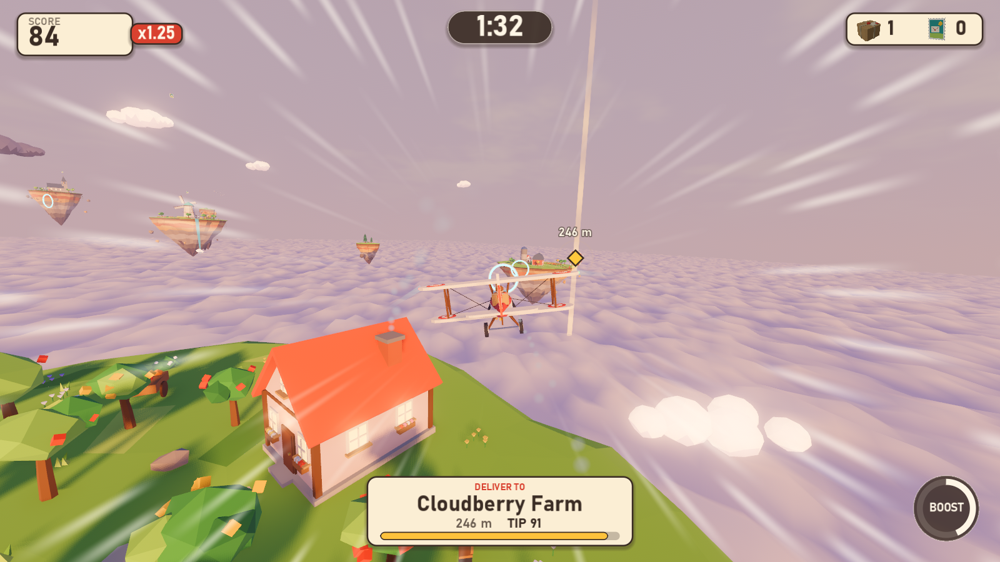 |  |
| 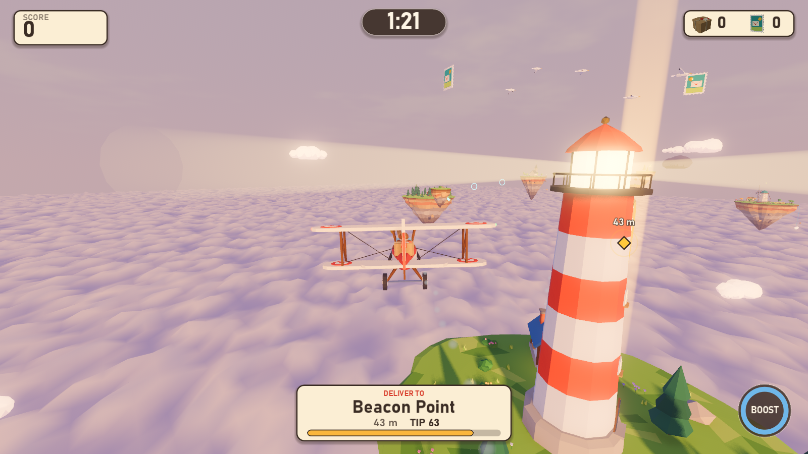 | 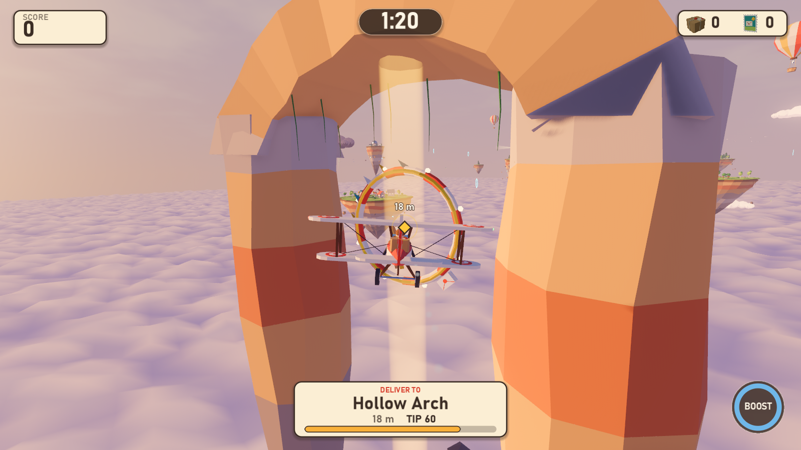 |
| 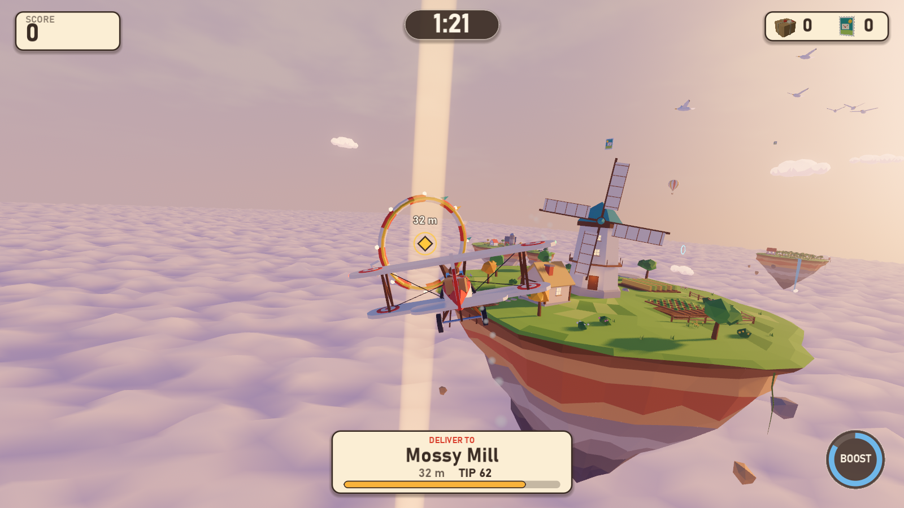 | 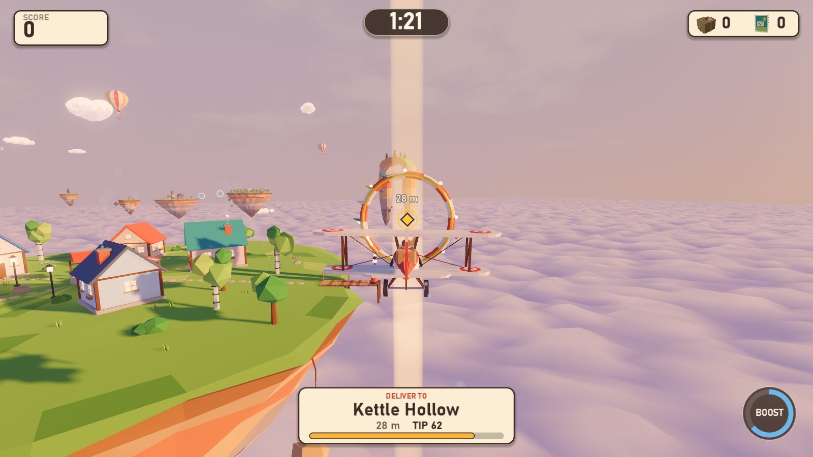 |

More: [all ten islands](docs/devlog/m4/gallery), [every model's preview sheet](docs/previews),
and the [build timeline](docs/progress/LOG.md) from greybox to final.

## How it is made

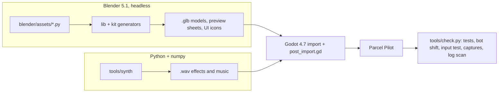

**Models (26 assets, 99k triangles).** `blender/lib` holds a shared palette (every color
in the game is a named material defined once), a small bmesh geometry kit, and the
exporter. `blender/kit` builds reusable pieces: floating islands (one watertight loft
from grass top through soil lip and rock strata to a stalactite tip), trees, cottages
with framed lit windows, a windmill, a lighthouse, a barn, a chapel, an observatory.
Each file in `blender/assets` composes those into an island diorama, the biplane, the
hoop, clouds, a balloon, gulls, a parachute parcel, and the 3D title logo. Building an
asset also renders a four-view contact sheet for review and, for some, a UI icon.

**The Blender to Godot contract** is nothing but object names:

| Name | Meaning in the game |
|---|---|
| `MK_Delivery`, `MK_Spawn`, `MK_Stamp*`, `MK_Parcel` | gameplay sockets (hoop, spawn, stamps, the carried parcel) |
| `FX_Smoke*`, `FX_Light*`, `FX_Mist*`, `FX_Fire*`, `FX_Beacon*`, `FX_Exhaust`, `FX_WingTip*` | effect sockets: chimney smoke, lamps, waterfall mist, campfire, lighthouse beam, exhaust, contrails |
| `SPIN_*` | parts the game spins (propeller, windmill sails, weather vane, orrery) |
| `FLAG_*`, `BOLT_*` | cloth that waves in a shader, lightning that flashes |
| `-col`, `-colonly` | Godot's import-time collision |

**Sound (20 files).** `tools/synth` is a small DSP toolkit (oscillators, filters,
convolution reverb, a Karplus-Strong plucked string, FM bells). It renders 19 effects
and a 37 second music loop in D major. Loops are built from whole cycles and circular
filtering, so they repeat without a click, and carry loop points in the WAV file.

**Everything else.** Textures are gradients generated at runtime; the sky, the sea of
clouds, the hoop beacon, the waving flags and the speed lines are shaders; fonts are the
operating system's (Bahnschrift on Windows).

## How it is verified

`python tools/check.py` is the gate every milestone had to pass:

| Step | What it proves |
|---|---|
| assets | every model rebuilds; triangle budgets and required sockets hold |
| audio | every sound rebuilds; no clipping, no DC offset, seamless loops |
| import | Godot imports everything with zero errors or warnings |
| unit | 13 tests on the scoring rules (tips, grades, combos, ranks, destination choice) |
| input | real key events drive the menus and the plane |
| bot | an autopilot flies a whole shift, headless, and must deliver parcels and reach the results |
| capture | a windowed tour saves frames from the player camera and measures frame rate |
| showcase | a gallery of every island, also from the player camera |

Any error or warning in any log fails the gate. Along the way it caught a black world
(NaN in the sky's radiance bake), audio streams leaking at exit, and sounds played after
shutdown; an independent code review caught two more audio bugs. Other tools:
`tools/lookdev.py` renders one frozen moment under several lighting variants side by
side, `tools/audio_report.py` draws spectrograms so sounds can be reviewed by eye, and
`tools/snap.py` adds entries to the [progress log](docs/progress/LOG.md).

## The public site

[parcel-pilot-1ms.pages.dev](https://parcel-pilot-1ms.pages.dev/) is a Cloudflare Pages site: the
landing page (`site/`, plain HTML, CSS and JS in the game's own palette, system fonts only)
at `/` and the game at `/play/`.

```bash
python tools/film.py
```

```bash
python tools/make_media.py
```

```bash
python tools/build_site.py --deploy
```

`film.py` records three reels under Godot's movie maker at 1080p: one whole shift flown by
the bot (with the game's sound), a set of staged moments (a ring run, a stamp, a storm, an
express delivery) and a fly-in to every island. `make_media.py` cuts the page's clips,
posters, hero reel, the whole-shift video and its chapter timeline, and the README
animations, all placed by event marks the game printed while filming. `build_site.py`
exports the web build, assembles `site-dist/` and publishes it with wrangler
(`--serve` runs it locally instead).

Notes on the web build:

* It runs on Godot's Compatibility renderer (WebGL 2), which has no SSAO and fogs the
  cloud sea differently, so `game/scripts/world/world.gd` retunes the sea there. The look
  was matched against the desktop build with `tools/lookdev.py`.
* Cloudflare Pages serves files of up to 25 MiB and the engine is about 40 MB, so
  `build_site.py` splits it and the page shell (`game/web/shell.html`) streams the parts
  back together.
* Pages ignores byte-range requests, which Safari needs for video, so
  `functions/media/[[path]].js` answers them for the videos.
* Every draw call is expensive in WebGL, and every palette color was its own surface
  (about 40 per island). The import step (`game/pipeline/post_import.gd`) now merges each
  mesh's palette surfaces into one, carrying each face's color, roughness, metallic and
  glow in its vertices for one palette shader (`game/shaders/palette.gdshader`): draw
  calls fell from about 490 to about 100 on the desktop too, with the same look.
* A browser compiles each distinct material shader on a first visit (seconds apiece on
  Windows), so fewer shaders also means a faster first start: about a minute became
  about half a minute. Later visits start in a few seconds.
* Each frame, Emscripten's commit step asked WebGL a question that made the page wait
  for the GPU to finish the frame; the shell answers it itself, which let the CPU and GPU
  overlap (about 44 fps became 54 to 68 in Chrome on the target laptop).

## Rebuild everything

Blender 5.1 and Godot 4.7 are found automatically on Windows; set the `BLENDER` and
`GODOT` environment variables to point elsewhere. The built models and sounds are
committed, so this is only needed after changing a generator.

```bash
python tools/build_assets.py
```

```bash
python tools/build_audio.py
```

```bash
python tools/check.py --milestone wip --showcase
```

## Repository layout

```
blender/    lib (palette, geometry kit, export), kit (generators), assets (one file per model family)
tools/      build_assets, build_audio + synth/, check (the gate), lookdev, snap, make_clip, audio_report,
            film, make_media, build_site (the public site)
game/       the Godot project: scripts, scenes, shaders, data (tuning .tres), tests, generated assets,
            web/shell.html (the browser loading page)
site/       the landing page and its media; functions/ holds the Pages Function for video ranges
docs/       DESIGN.md (spec), PROMPT.md (the brief), PLAN.md, previews/, devlog/ (gate captures), progress/
```

## The brief

This project started from a one-paragraph prompt: build a small Godot game whose every
model is a Blender script, in greybox, art, and juice milestones, capturing errors and
player-camera screenshots after each. [docs/PROMPT.md](docs/PROMPT.md) is that prompt
rewritten as a reusable brief, [docs/DESIGN.md](docs/DESIGN.md) is the game design it
produced, and the commit history follows the milestones: M0 foundations, M1 greybox
loop, M2 art pass, M3 juice, M4 ship, M5 the web build and the public site.

Built with Claude Code (Claude Opus 5.5).
