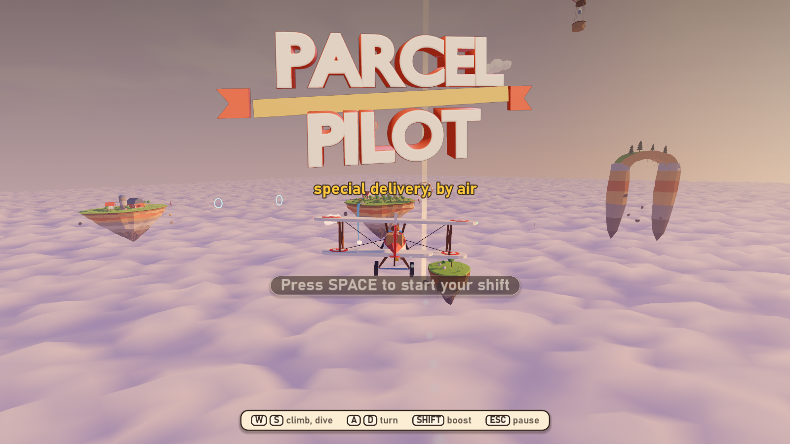
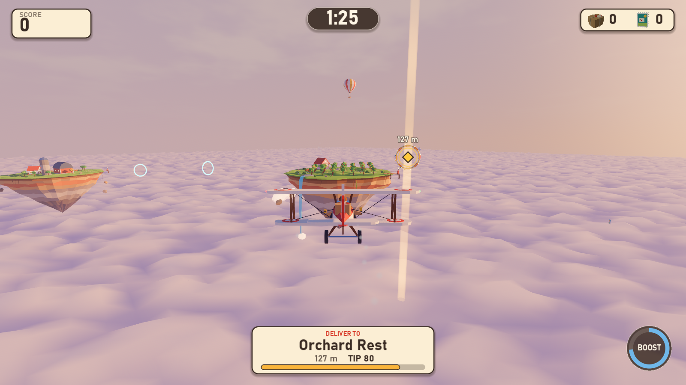
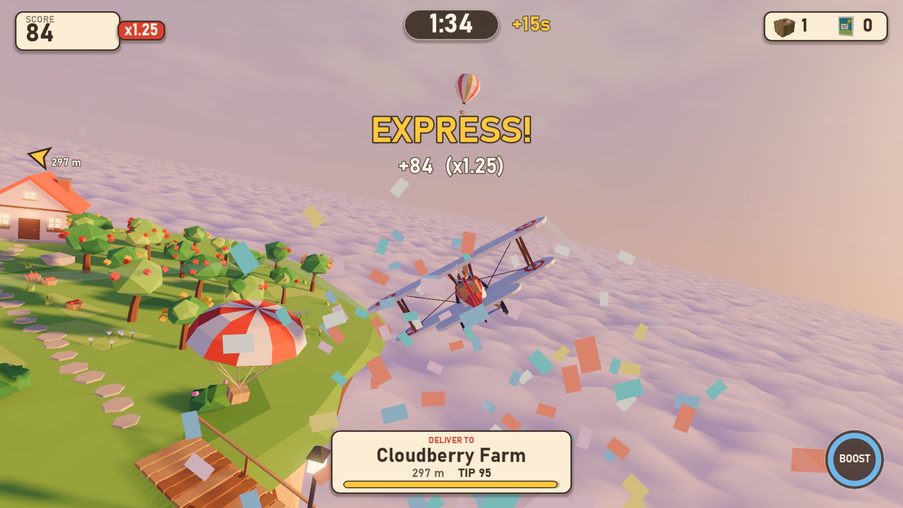
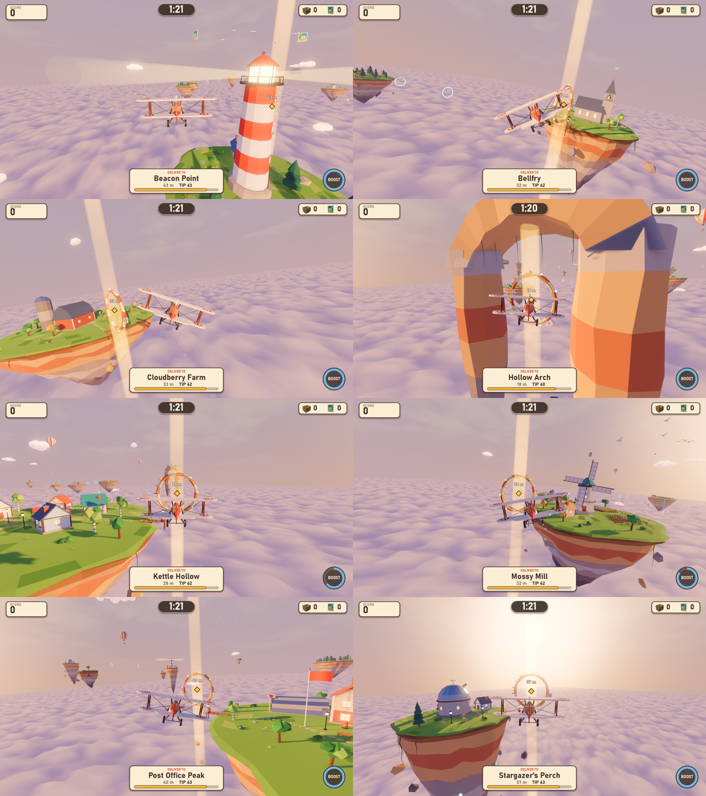
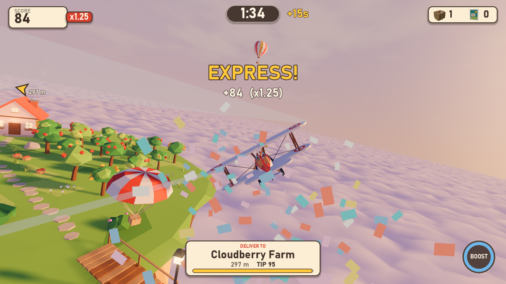
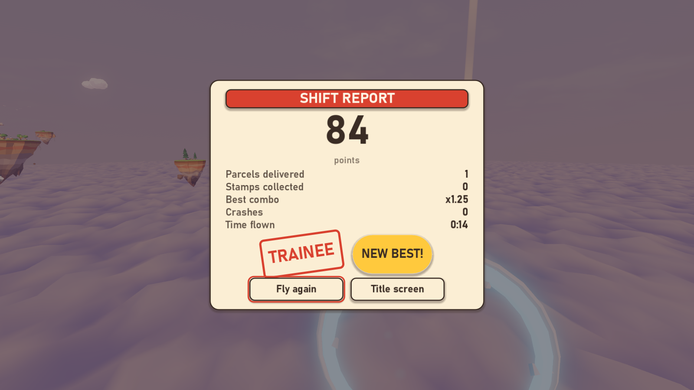
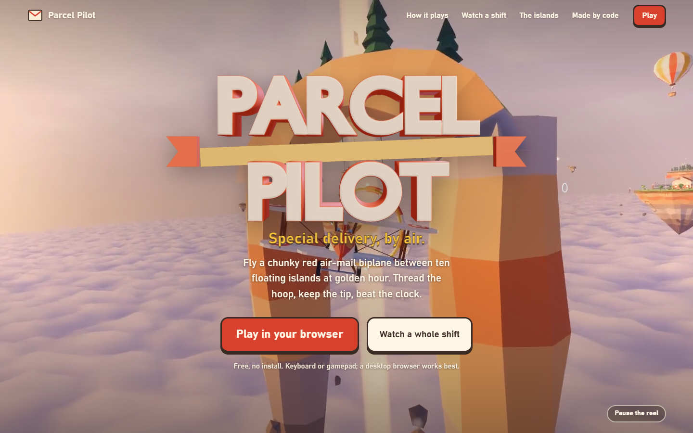
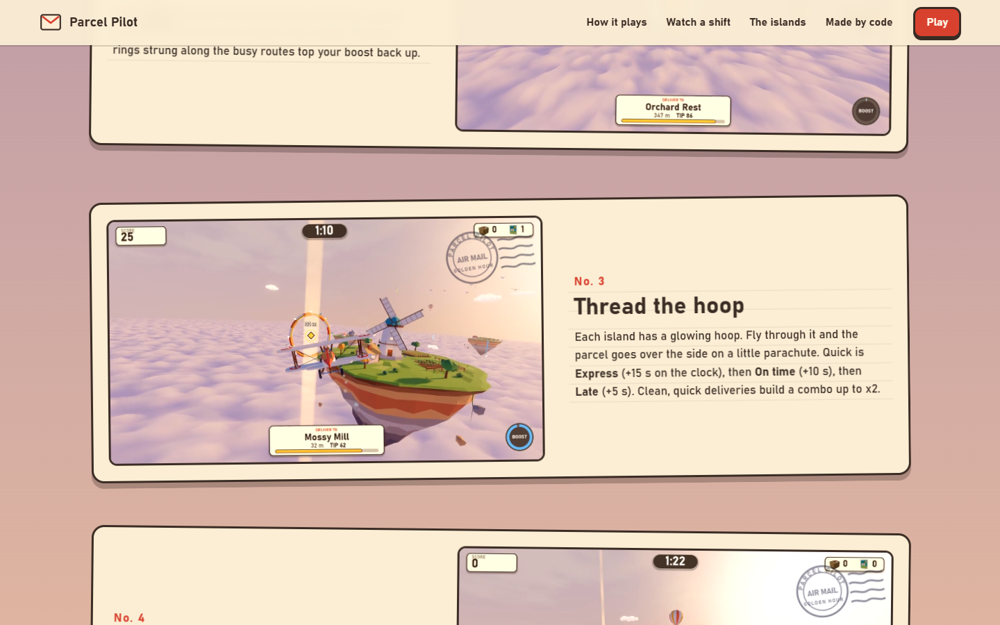
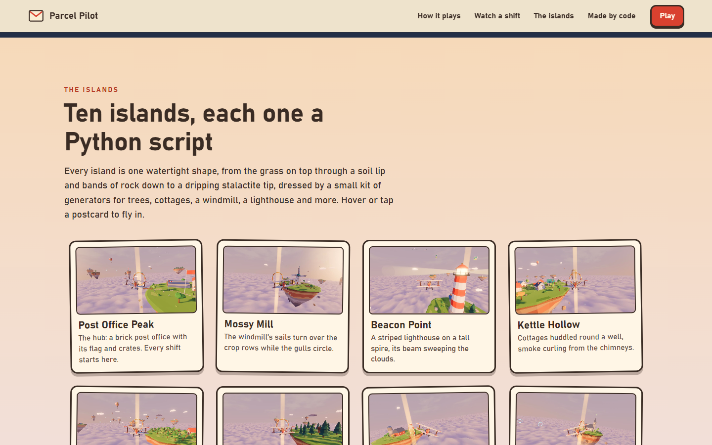
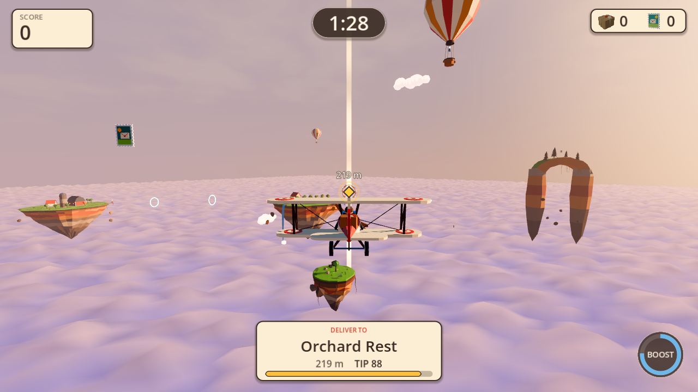

# Progress log

A timeline of Parcel Pilot's build, one entry per snapshot (`python tools/snap.py`).
Frames are the player camera unless noted.

## 001 First Blender-scripted model inside Godot

2026-09-24 16:41, commit `b65ad71` (M0)

The pipeline proven end to end: a Python script in Blender builds the greybox plane,
exports a .glb, Godot 4.7 imports it with every named socket intact, and the dev harness
saves this frame from the game camera.

## 002 Greybox loop playable (M1)

2026-09-24 17:35, commit `0107a7b`

Blockout islands at gameplay scale, the full title, play and results cycle, a bot that
delivers 12 parcels in a headless shift, and a plain HUD with the off-screen pointer.
Full capture set: [docs/devlog/m1](../devlog/m1).

## 003 Art pass: final models and golden-hour atmosphere

2026-09-24 18:19, commit `0107a7b`

All 23 models rebuilt as final procedural art (biplane, 10 island dioramas, islets, pickups, sky props), a custom golden-hour sky shader, a billowing cloud-sea shader that follows the camera, tuned fog, glow and AgX tonemapping (chosen with the new look-dev tool), island lamps and a flashing storm cloud.

## 004 Juice: synthesized audio, particles, polished UI

2026-09-24 19:22, commit `7cadbd9`

M3 in progress: every sound synthesized in Python (19 effects plus a music loop, checked with spectrograms), confetti and a parachute parcel on delivery, contrails, speed lines, chimney smoke, waving flags, gull flocks, a sweeping lighthouse beam, a redesigned HUD with Blender-rendered icons, a 3D title logo, and a shift report with a rank stamp. The gallery is eight islands seen from the player camera.

## 005 Shipped: final build

2026-09-24 20:07, commit `1e9f65c`

M4: the verification gate is green across all eight steps (assets, audio, import, unit, input, bot, capture, showcase), a fresh clone imports cleanly and passes the headless tests, the README tells the whole story, and gameplay footage lives in docs/media/gameplay.webp.

## 006 Live on the web

2026-09-26 16:51, commit `5e3f62a`

M5: the game runs in the browser at https://parcel-pilot-1ms.pages.dev/play/ and the landing page at https://parcel-pilot-1ms.pages.dev/ shows it off: a hero reel of island fly-ins under the game's own 3D logo, six postcard clips, one whole shift with the synthesized sound and a clickable timeline, all ten islands, a sound board and a greybox-to-final slider. Every clip was filmed frame by frame by Godot's movie maker. Making the web build fast took three fixes found by measuring: one palette shader instead of one surface per color (draw calls 490 to 100), two shadow cascades in the browser, and a loader shim that stops a per-frame GPU wait.

