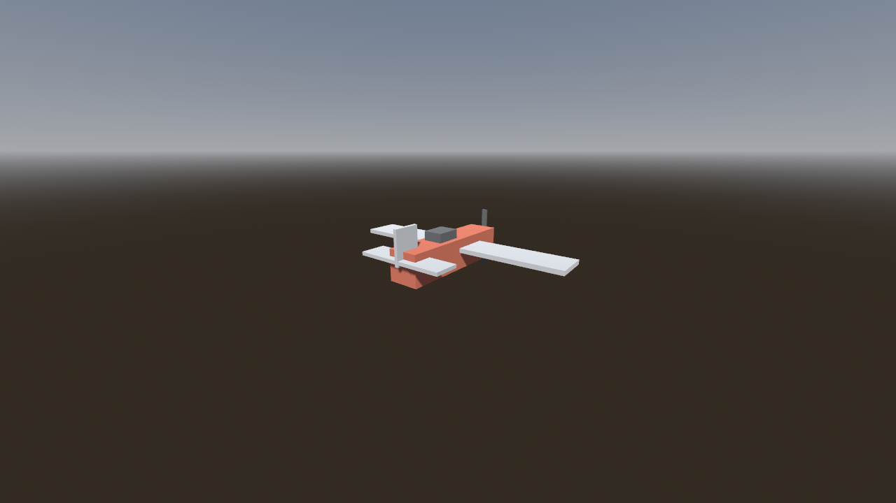
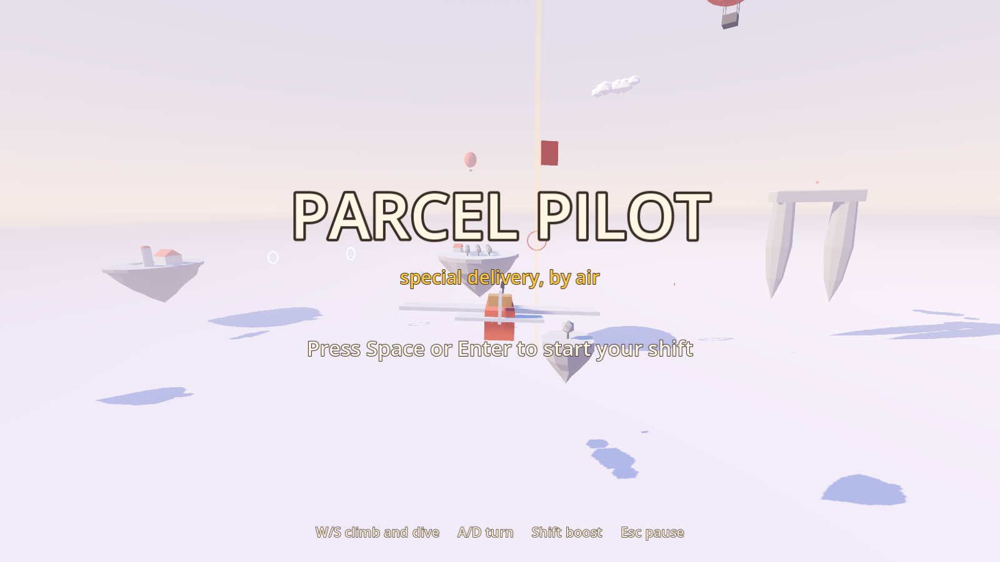
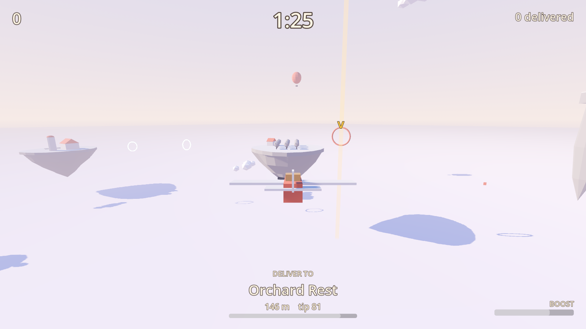
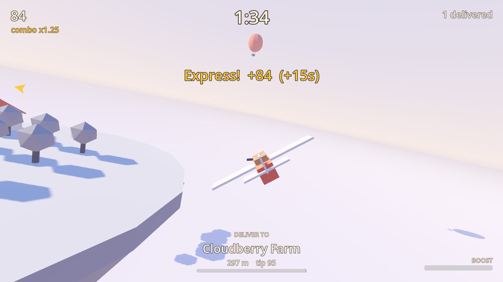
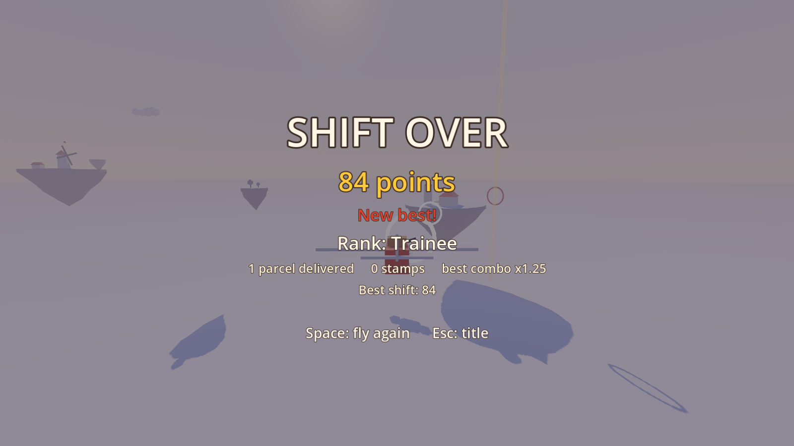
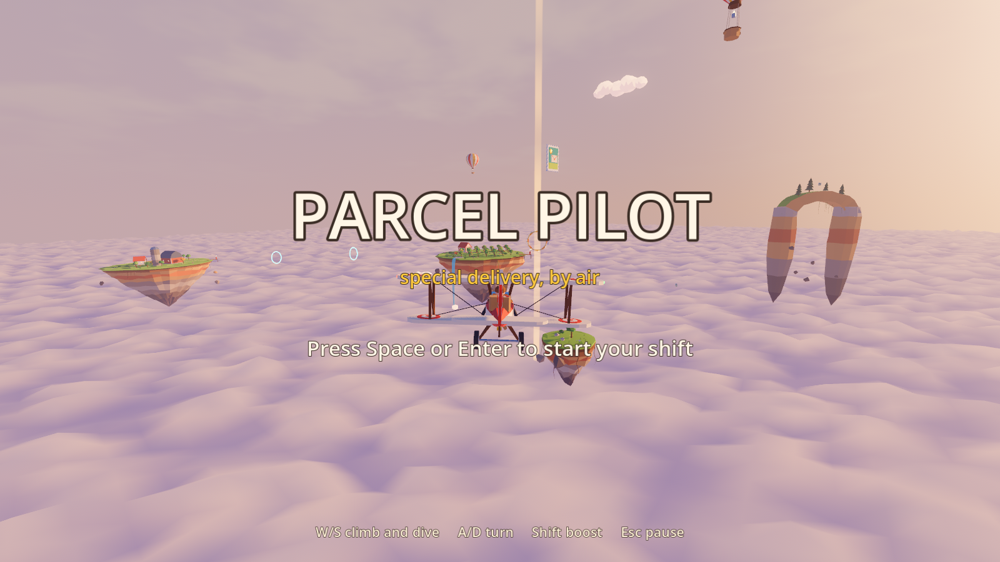
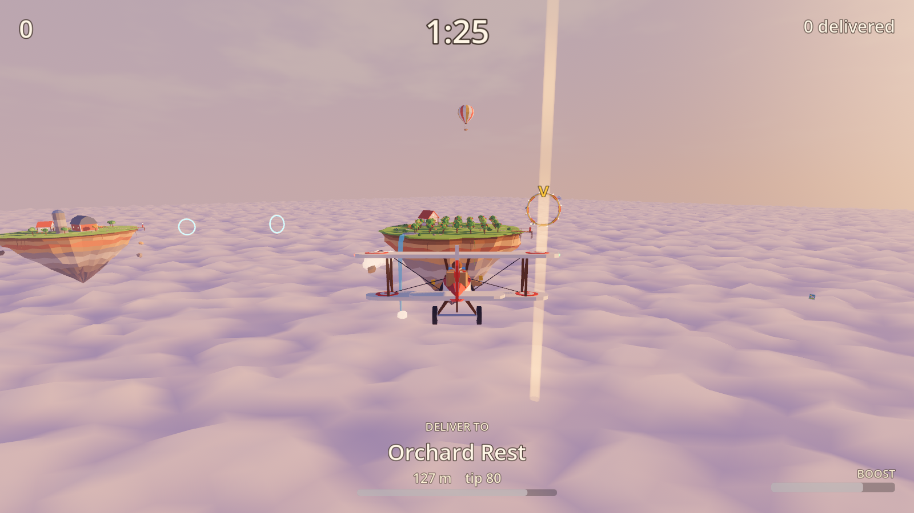
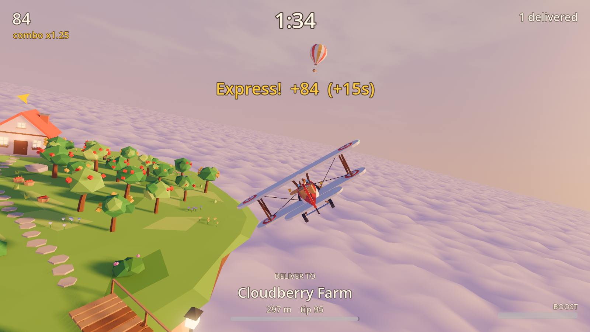
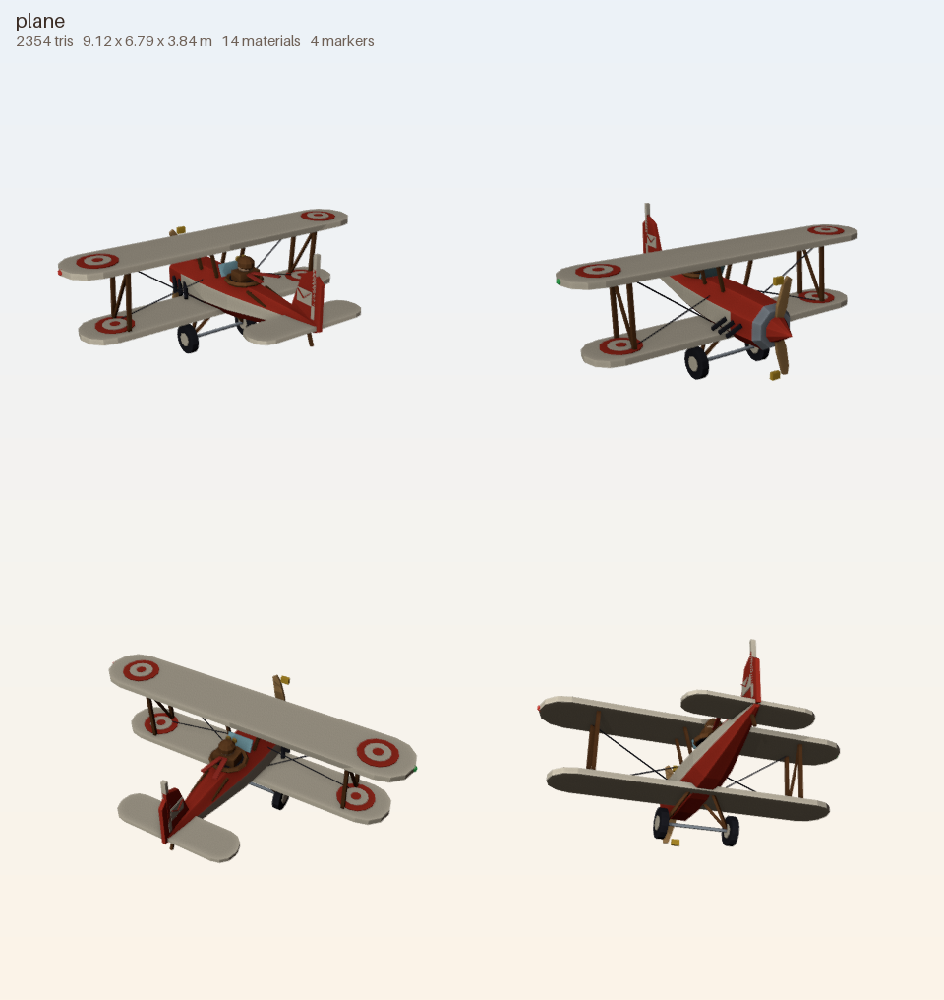

# Progress log

A timeline of Parcel Pilot's build, one entry per snapshot (`python tools/snap.py`).
Frames are the player camera unless noted.

## 001 First Blender-scripted model inside Godot

2026-09-24 16:41, commit `b65ad71` (M0)

The pipeline proven end to end: a Python script in Blender builds the greybox plane,
exports a .glb, Godot 4.7 imports it with every named socket intact, and the dev harness
saves this frame from the game camera.

## 002 Greybox loop playable (M1)

2026-09-24 17:35, commit `0107a7b`

Blockout islands at gameplay scale, the full title, play and results cycle, a bot that
delivers 12 parcels in a headless shift, and a plain HUD with the off-screen pointer.
Full capture set: [docs/devlog/m1](../devlog/m1).

## 003 Art pass: final models and golden-hour atmosphere

2026-09-24 18:19, commit `0107a7b`

All 23 models rebuilt as final procedural art (biplane, 10 island dioramas, islets, pickups, sky props), a custom golden-hour sky shader, a billowing cloud-sea shader that follows the camera, tuned fog, glow and AgX tonemapping (chosen with the new look-dev tool), island lamps and a flashing storm cloud.

